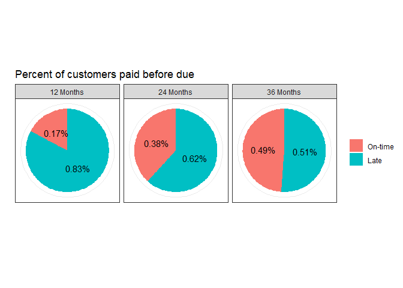

Logistic Regression
================

## Study

A local bank provides loans to customers with 0% interest over a 12-,
24-, or 36- month period. The bank owner hypothesizes that customers
will be more likely to pay on-time if they have to pay less per month;
allowing customers to use a smaller portion of personal income on a
short-term basis.

To test this hypothesis, the owner decides to model the relationship
between “allocated pay periods” and whether customers make on-time
payments for <i>all of</i> the first 6 months.

## Data simulation

``` r
set.seed(1500)
options(scipen=1, digits=3) # number formatting

##### Simulate data ---------------
grp.12 <- sample(c(0, 1), 
                 prob = c(0.2, 0.8),
                 size = 58,
                 replace = TRUE)
grp.24 <- sample(c(0, 1), 
                 prob = c(0.35, 0.65),
                 size = 76,
                 replace = TRUE)
grp.36 <- sample(c(0, 1), 
                 prob = c(0.455, 0.545),
                 size = 88,
                 replace = TRUE)

df <- data.frame(
  Repay = append(append(grp.12, grp.24), grp.36),
  Months = append(append(rep('12 Months', 58), 
                 rep('24 Months', 76)),
                 rep('36 Months', 88)))
```

## Data visualization

First, let’s look our data in terms of the proportion of customers that
completed their first 6 monthly payments on-time. We group this by
allocated pay period.

``` r
library(dplyr)
library(ggplot2)
theme_set(theme_bw())

##### Make summary table ---------------

## add 0/1 counts by group
repay.perc <- df %>%
  group_by(Months, Repay) %>%
  count(Repay) %>%
  ungroup() %>%
  group_by(Months) %>%
  mutate(freq = n / sum(n)) %>%
  arrange(-Repay)

##### Graph ---------------
ggplot(repay.perc, aes(x = factor(1))) +
  geom_col(aes(y = freq, fill = factor(Repay)), position = 'stack') +
  coord_polar(theta = "y") +
  labs(title = 'Percent of customers paid before due') +
  geom_text(aes(y = freq, label = sprintf("%.2f%%", freq)),
            position = position_stack(vjust = 0.5)) +
  facet_wrap(. ~ Months) +
  scale_x_discrete(name = " ", breaks = NULL) +
  scale_y_continuous(name = " ", breaks = NULL) +
  scale_fill_discrete(label = c('On-time', 'Late')) +
  theme(legend.title = element_blank())
```

<!-- -->

There is a clear increase in customers that made timely payments when
more time is allocated and monthly payments are smaller.

## Model

Logistic regression is run similarly to “standard” models in terms of
coding. In this case, we start by constructing the same contrast codes
that can be used in a one-way ANOVA.

The first contrast represents the difference between the average for the
12 month group and the average of the 24- and 36- month groups. In other
words: does allowing more than a lone 12-month repayment option affect
the percent of customers that repay their first 6 payments on-time?

The second contrast represents the difference between the average
repayments at 24 months and 36 months.

``` r
##### Apply contrasts ---------------
df$con1 <- (df$Months == '12 Months')*(-1) + (df$Months == '24 Months')*(0.5) + (df$Months == '36 Months')*(0.5)

df$con2 <- (df$Months == '12 Months')*(0) + (df$Months == '24 Months')*(-0.5) + (df$Months == '36 Months')*(0.5)
```

Now that each group has a column for their corresponding contrast
weights, we can input them into the model.

``` r
##### Model data ---------------
mod1 <- glm(Repay ~ con1 + con2, 
           data = df, family = 'binomial')
mod1.summ <- summary(mod1)

print(mod1.summ)
```

    ## 
    ## Call:
    ## glm(formula = Repay ~ con1 + con2, family = "binomial", data = df)
    ## 
    ## Deviance Residuals: 
    ##    Min      1Q  Median      3Q     Max  
    ## -1.875  -1.197   0.615   0.980   1.158  
    ## 
    ## Coefficients:
    ##             Estimate Std. Error z value Pr(>|z|)    
    ## (Intercept)    0.699      0.157    4.45  8.6e-06 ***
    ## con1          -0.870      0.255   -3.41  0.00064 ***
    ## con2          -0.437      0.318   -1.37  0.16923    
    ## ---
    ## Signif. codes:  0 '***' 0.001 '**' 0.01 '*' 0.05 '.' 0.1 ' ' 1
    ## 
    ## (Dispersion parameter for binomial family taken to be 1)
    ## 
    ##     Null deviance: 292.43  on 221  degrees of freedom
    ## Residual deviance: 276.33  on 219  degrees of freedom
    ## AIC: 282.3
    ## 
    ## Number of Fisher Scoring iterations: 4

The interpretation of the results is in term of logits. Because of this,
we should transform the data to make our parameters meaningful. By
exponentiating the coefficients of the results, we can effectively
change logits into odds.

``` r
coefss <- exp(coef(mod1.summ)[,'Estimate'])
print(coefss)
```

    ## (Intercept)        con1        con2 
    ##       2.012       0.419       0.646

``` r
conf.ints <- as.data.frame(exp(confint(mod1)))
```

    ## Waiting for profiling to be done...

``` r
print(conf.ints)
```

    ##             2.5 % 97.5 %
    ## (Intercept) 1.491  2.769
    ## con1        0.246  0.675
    ## con2        0.344  1.201

## Interpretation

##### Intercept

  - On average, across 12-, 24-, and 36- month payment plans, the odds
    of a customer being late on at least 1 of 6 payments is about 2:1.
    
      - If we repeatedly replicated this study, there is a 95% chance
        that these odds would be between 1.491 and 2.769

##### 12 months vs. 24- and 36- months

  - The odds of a customer making all payments on-time is, on average,
    about 2.4 times higher for customers with 24- or 36- month financing
    than 12- month financing
      - This is statistically significant (<i>p</i> \< .001)
      - If we replicated this study, there is a 95% chance that these
        odds would be between 0.246 and 0.675

##### 24 months vs. 36 months

  - On average customers who chose a 36-month pay period are around 1.5
    times more likely to make all payments on-time than customers who
    choose a 24-month plan
    
      - This is not statistically significant (<i>p</i> = 0.169)
    
      - If we repeatedly replicated this study, there is a 95% chance
        that these odds would be between 0.344 and 1.201
