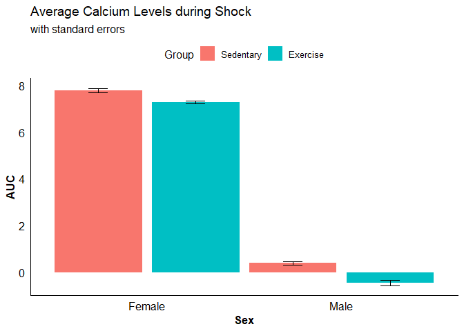
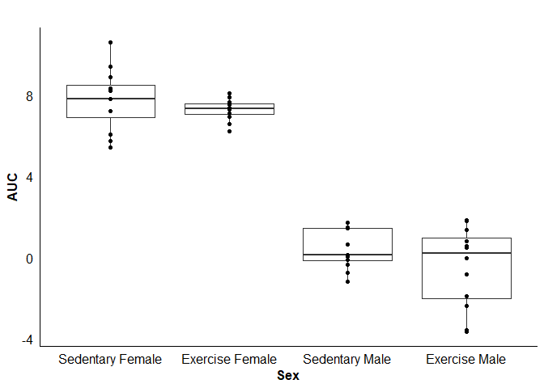
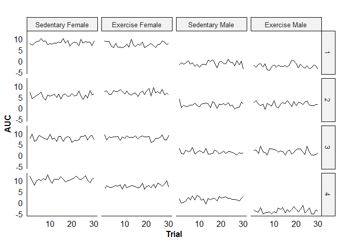
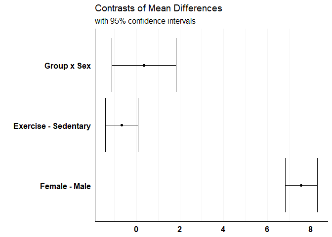

Multilevel Model (factorial)
================

## Study

A behavioral neuroscience lab that studies learned helplessness is
testing a new technology which measures calcium activity in the brain.
One previous study tested the effect of exercise on activity in the
medial prefrontal cortex (mPFC) in response to stress. However, this
study only used male subjects. The present lab has previously discovered
that neural activity in the mPFC resulting from stressful situations is
different between male and female rats. Additionally, activity was
measured using a different technology. Therefore, one researcher decides
to test if exercise will alter aggregate calcium levels in this region
and affect how the mPFC reacts to uncontrollable stress.

For 6 weeks beforehand, an experimental group (exercise) is given a
wheel to run on in their cage. A control (sedentary) group is also given
a wheel to run on for this time period, but it is locked and therefore
non-functional. The researcher also includes subjects of both sexes. To
connect behavior and neural activity during the experiment, calcium
activity is continuously recorded before and through 30 trials of
inescapable shock (IS); in which the subject does not have behavioral
control over the stressor.

The data is first centered at baseline, then aggregated to remove the
dimension of time within trials. This is accomplished by using the area
under the curve (AUC) to compact time and aggregate calcium levels into
one measurement. This use of the AUC metric is representing aggregate
levels of calcium relative to the pre-trial baseline. To be specific,
this makes the interpretation of AUCs: “mPFC activity over the course of
shock relative to pre-trial baseline.”

## Why this model?

The reasoning behind using a multilevel model is pretty straightforward
in this case:

  - Due to individual differences in stress resilience and overall
    neurobiology, we at least assume that we should give each subject
    their own intercept
  - We want to consider any potential change in activity that occurs
    over trials in case of a trend or sudden drop/increase. So we should
    construct a model to measure if Trial is a significant predictor of
    AUC. We should also add a random slope across Trials for each
    individual; allowing the change across trials to differ between
    subjects

## Setup

### Packages/functions

``` r
suppressMessages(library(kableExtra)) # table options
suppressMessages(library(dplyr)) # data manipulation
suppressMessages(library(psych)) # some analytics
suppressMessages(library(ggplot2)) # visualization
suppressMessages(library(ggpubr)) # good theme
suppressMessages(library(lme4)) # mixed model
suppressMessages(library(lmerTest)) # p-values for lme4
suppressMessages(library(optimx)) # optimizer
suppressMessages(library(performance)) # effect sizes

set.seed(150) # for data simulation replicability
theme_set(theme_pubr() %+replace%
            theme(axis.ticks = element_blank(),
                  axis.title = element_text(face = 'bold'))) # theme option overrides

lmer.opts <- lmerControl(optimizer = 'optimx',
                         optCtrl=list(
                           method = 'L-BFGS-B')) # for convergence

##### Functions ---------------
source('Multilevel_Factorial/Functions multilevel 1.R')
```

### Data simulation

We generate our data using approximate means and standard deviations
from the actual experiment.

``` r
##### Summary stats from small n study ---------------
df <- data.frame(
  Group = c('Sedentary', 'Sedentary', 'Exercise', 'Exercise'),
  Sex = c('Male', 'Female', 'Male', 'Female'),
  Mean = c(0.24, 4.27, -1.6, 4.25),
  Sd = c(1.12, 1.61, 2.9, 1.13)
)

##### Simulate data ---------------
multi.sims <- mapply(function(m, s){
  sim.multi(n.obs = 12, 
            nvar = 1, nfact = 1,
            ntrials = 30, days = 1,
            mu = m, sigma = s,
            plot = FALSE)
}, m = df$Mean, s = df$Sd)

names(multi.sims) <- rep(c('IV', 'AUC', 'Trial', 'Subject.num'), 4)

##### Format data ---------------
group.names <- paste(df$Group, df$Sex) # add group names

### Move into separate data frames and label

sed.male <- do.call(cbind, multi.sims[2:4]) %>%
  as.data.frame() %>%
  mutate(Group = 'Sedentary', Sex = 'Male')

sed.fem <- do.call(cbind, multi.sims[6:8]) %>%
  as.data.frame() %>%
  mutate(Group = 'Sedentary', Sex = 'Female')

ex.male <- do.call(cbind, multi.sims[10:12]) %>%
  as.data.frame() %>%
  mutate(Group = 'Exercise', Sex = 'Male')

ex.fem <- do.call(cbind, multi.sims[14:16]) %>%
  as.data.frame() %>%
  mutate(Group = 'Exercise', Sex = 'Female')

### Combine into final data frame
df <- rbind(sed.male, sed.fem, ex.male, ex.fem)

### Make trial into 1-30
df <- df %>%
  group_by(Group, Sex, Subject.num) %>%
  arrange(Trial) %>%
  mutate(Trial = 1:n())

glimpse(df)
```

    ## Observations: 1,440
    ## Variables: 5
    ## Groups: Group, Sex, Subject.num [48]
    ## $ AUC         <dbl> -1.704, 4.019, 3.106, 1.728, 2.072, 2.018, 0.649, ...
    ## $ Trial       <int> 1, 1, 1, 1, 1, 1, 1, 1, 1, 1, 1, 1, 1, 1, 1, 1, 1,...
    ## $ Subject.num <dbl> 1, 2, 3, 4, 5, 6, 7, 8, 9, 10, 11, 12, 1, 2, 3, 4,...
    ## $ Group       <chr> "Sedentary", "Sedentary", "Sedentary", "Sedentary"...
    ## $ Sex         <chr> "Male", "Male", "Male", "Male", "Male", "Male", "M...

Now we have our data set. Each combination of group and sex (IV’s) has
10 subjects; with an AUC (DV) value for each of the 30 trials.

## Data visualization

We start by making a summary frame grouped by Group and Sex from our
simulated data.

<details>

<summary>Click for explanation</summary>

<p>

A bar graph is a very basic and ubiquitous method of displaying
categorical data. Here, the bars represent the means of our grouping
variables. Error bars featuring the standard error (SE) are often added
to these bars to give an idea of how well the sample means from our
study represent the population; with longer error bars indicating less
certainty.

</p>

</details>

<BR>

``` r
##### Summarize ---------------
df.summ1 <- df %>%
  group_by(Group, Sex) %>%
  summarize(Mean = mean(AUC), Se = se(AUC)) %>%
  mutate(Upper = Mean + Se,
         Lower = Mean - Se)

### re-level
df.summ1$Group <- factor(df.summ1$Group, levels = c('Sedentary', 'Exercise'))
df.summ1$Sex <- factor(df.summ1$Sex, levels = c('Female', 'Male'))

##### Graph ---------------
ggplot(df.summ1) +
  geom_bar(aes(x = Sex, y = Mean, 
               fill = Group, group = Group),
           stat = 'identity', position = position_dodge(width = 1)) +
  geom_errorbar(aes(x = Sex, 
                    ymin = Lower, ymax = Upper,
                    group = Group),
                position = position_dodge(width = 1), width = 0.2) +
  labs(x = 'Sex',
       y = 'AUC',
       title = 'Average Calcium Levels during Shock',
       subtitle = 'with standard errors')
```

<!-- -->

There is clearly a difference in averages between males and females. The
graph suggests that there may be an effect of exercise, but it is
relatively small if it is.

Next, we move to the between-subject individual level by making a
summary data frame from our original data. This data frame will be
grouped by Group, Sex, and Subject number.

<details>

<summary>Click for explanation</summary>

<p>

The graph itself - a box plot - shows the minimum, 25th percentile,
median, 75th percentile, and maximum. In a broader sense, the box
represents individuals within the middle 50% of values by group. The
lines extending from the box represent the extremes. Adding data points
allows us to look at how average DV values for each individual are
distributed.

</p>

</details>

<BR>

``` r
grps.ordered <- c('Sedentary Female', 'Exercise Female', 'Sedentary Male', 'Exercise Male')

##### Summarize ---------------
df.summ2 <- df %>%
  group_by(Group, Sex, Subject.num) %>%
  summarize(Mean = mean(AUC)) %>%
  mutate(Group2 = paste(Group, Sex)) # new grouping

### fix new grouping order
df.summ2$Group2 <- factor(df.summ2$Group2, levels=grps.ordered)

##### Graph ---------------
ggplot(df.summ2) +
  geom_boxplot(aes(x = Group2, y = Mean)) +
  geom_point(aes(x = Group2, y = Mean)) +
  labs(x = 'Sex', y = 'AUC',
       title = '')
```

<!-- -->

We then work our way down to the within-subject individual level by
using the original data and plotting subjects across all trials. In
practice, we want to look at all of the subjects. But for this example,
we will look at the first 4 subjects in each group to avoid an
overwhelming amount of visuals.

<details>

<summary>Click for explanation</summary>

<p>

We can use facets to conveniently view subjects along all trials.
Viewing them in this manner helps find any trends that may occur across
trials within subjects, or any abrupt increases or decreases in calcium
levels. In the event of a trend, we can easily see if that trend differs
between groups. While the change across trials is not one of the main
hypotheses, but it is something that could affect the results.

</p>

</details>

<BR>

``` r
##### New labels ---------------
df$Group2 <- paste(df$Group, df$Sex)
df.sub <- df[df$Subject.num %in% c(1:4),]

df.sub$Group2 <- factor(df.sub$Group2, levels=grps.ordered)

##### Graph ---------------
ggplot(df.sub) +
  geom_line(aes(x = Trial, y = AUC)) +
  labs(x = 'Trial', y = 'AUC',
       title = '') +
  facet_grid(Subject.num ~ Group2) +
  scale_x_continuous(breaks = c(10, 20, 30))
```

<!-- -->

There is no specific trend across trials that is noticeable in any
group. This is not necessarily surprising; as the manipulation does not
involve any learning effect or mid-trial alteration in any experimental
manner.

## Pre-model

Before we construct this model, we must first add a column that has each
individual subject. If we simply input the group subject number, R may
incorrectly specify our random effects.

``` r
df$Subject <- paste0('S', rep(1:48, 30))
```

The last step of preparation is constructing the contrast codes.
Specifically, we want to know:

  - Is there an effect of sex on AUC? <BR>
  - Is there an effect of exercise on AUC? <BR>
  - Does the effect of exercise depend on the subject’s sex? <BR>

<!-- end list -->

``` r
df$group.con <- ifelse(df$Group == 'Sedentary', -0.5, 0.5)
df$sex.con <- ifelse(df$Sex == 'Male', -0.5, 0.5)
```

## Model

### OMNIBUS

To construct our model, we begin at a random intercept model by
including the following: <BR>

  - 1 DV… `AUC` <BR>
  - 2 IV’s… `Group + Sex` <BR>
  - A Group-Sex interaction… `Group:Sex` <BR>
  - A random intercept for each subject `(1 | Subject)` <BR> <BR>

We also use ML instead of REML for estimation to measure the effects of
our individual parameters by using model comparison.

``` r
mod1 <- lmer(AUC ~ (1 | Subject) + group.con + sex.con + group.con:sex.con, data = df, REML = FALSE, control = lmer.opts) # ML for model comparisons
print(summary(mod1))
```

    ## Linear mixed model fit by maximum likelihood . t-tests use
    ##   Satterthwaite's method [lmerModLmerTest]
    ## Formula: AUC ~ (1 | Subject) + group.con + sex.con + group.con:sex.con
    ##    Data: df
    ## Control: lmer.opts
    ## 
    ##      AIC      BIC   logLik deviance df.resid 
    ##     4341     4372    -2164     4329     1434 
    ## 
    ## Scaled residuals: 
    ##    Min     1Q Median     3Q    Max 
    ## -3.168 -0.673  0.016  0.662  2.884 
    ## 
    ## Random effects:
    ##  Groups   Name        Variance Std.Dev.
    ##  Subject  (Intercept) 1.67     1.29    
    ##  Residual             1.04     1.02    
    ## Number of obs: 1440, groups:  Subject, 48
    ## 
    ## Fixed effects:
    ##                   Estimate Std. Error     df t value Pr(>|t|)    
    ## (Intercept)          3.750      0.188 48.000   19.91   <2e-16 ***
    ## group.con           -0.673      0.377 48.000   -1.79     0.08 .  
    ## sex.con              7.552      0.377 48.000   20.05   <2e-16 ***
    ## group.con:sex.con    0.353      0.753 48.000    0.47     0.64    
    ## ---
    ## Signif. codes:  0 '***' 0.001 '**' 0.01 '*' 0.05 '.' 0.1 ' ' 1
    ## 
    ## Correlation of Fixed Effects:
    ##             (Intr) grp.cn sex.cn
    ## group.con   0.000               
    ## sex.con     0.000  0.000        
    ## grp.cn:sx.c 0.000  0.000  0.000

Next, we check to see if our model is significantly improved by allowing
the change in AUC across trials from uncontrollable stress to be
different for each subject. We expect that it does not because of our
visual inspection above.

``` r
mod2 <- lmer(AUC ~ Trial + (1 + Trial|Subject) + group.con + sex.con + group.con:sex.con, data = df, REML = FALSE, control = lmer.opts)
```

    ## boundary (singular) fit: see ?isSingular

We receive a message that tells us our fit is singular. This is the
result of either the variance captured by a random effect being close to
0, or a correlation of +/- 1. A look at the random effects confirms that
the added slope of Trial is our culprit:

``` r
summary(mod2)$varcor
```

    ##  Groups   Name        Std.Dev. Corr 
    ##  Subject  (Intercept) 1.303315      
    ##           Trial       0.000771 -1.00
    ##  Residual             1.018775

So we leave the OMNIBUS model without a slope that can vary within
subjects across trials. Keep in mind that this still considers all 30
observations from the same subject, it just does not consider the
within-subject changes <i>across</i> trials.

We are now ready to move to the main analysis portion of the modeling
process. To perform comparisons, we create 4 models; with each one
(minus the most complex model) excluding a variable of interest.

## Model comparisons

Now that we have our models, we can compare them by using F-tests. With
these, we can measure the effect of each parameter separate of the
others. We start with the random effects.

``` r
##### No interaction model ---------------
mod2 <- lmer(AUC ~ (1 | Subject) + group.con + sex.con, REML = FALSE, data = df, control = lmer.opts)

##### Sex-only model ---------------
mod3 <- lmer(AUC ~ (1 | Subject) + sex.con, REML = FALSE, data = df, control = lmer.opts)

##### Group-only model ---------------
mod4 <- lmer(AUC ~ (1 | Subject) + group.con, REML = FALSE, data = df, control = lmer.opts)
```

We can get measures of effect size for both the random effects (ICC’s)
and fixed effects (R-squared). As-is, these effect sizes are in relation
to all fixed and/or random parameters in the model. For example, the
effect sizes of model 2 would be interpreted as such:

<b>ICC’s</b>

  - `Adjusted` - % variance in AUC explained by individual differences
  - `Conditional` - % variance in AUC explained by individual
    differences, after taking a subject’s Sex and Group into
    consideration
  - `Adjusted - Conditional` - % variance in individual differences in
    AUC explained by Sex and Group

<b>R-squared</b>

  - `Marginal` - % variance in AUC explained by fixed effects alone
  - `Conditional` - % explained variance by both fixed and random
    effects

To find the effect sizes for each set of parameters, we can use the
custom function `lmer_effects`.

``` r
### Find effect sizes
mod.list <- list(mod1, mod2, mod3, mod4)

mods.effects <- lapply(mod.list, lmer_effects)
mods.effects <- do.call(rbind, mods.effects)
mods.effects <- f(mods.effects)

### For printing
rownames(mods.effects) <- c('Group + Sex + Group:Sex', 'Group + Sex', 
                            'Sex only', 'Group only')

kable(mods.effects)
```

<table>

<thead>

<tr>

<th style="text-align:left;">

</th>

<th style="text-align:right;">

ICC.adj

</th>

<th style="text-align:right;">

ICC.cond

</th>

<th style="text-align:right;">

ICC.AminusC

</th>

<th style="text-align:right;">

R2.marg

</th>

<th style="text-align:right;">

R2.cond

</th>

</tr>

</thead>

<tbody>

<tr>

<td style="text-align:left;">

Group + Sex + Group:Sex

</td>

<td style="text-align:right;">

0.616

</td>

<td style="text-align:right;">

0.098

</td>

<td style="text-align:right;">

0.519

</td>

<td style="text-align:right;">

0.842

</td>

<td style="text-align:right;">

0.939

</td>

</tr>

<tr>

<td style="text-align:left;">

Group + Sex

</td>

<td style="text-align:right;">

0.617

</td>

<td style="text-align:right;">

0.098

</td>

<td style="text-align:right;">

0.519

</td>

<td style="text-align:right;">

0.841

</td>

<td style="text-align:right;">

0.939

</td>

</tr>

<tr>

<td style="text-align:left;">

Sex only

</td>

<td style="text-align:right;">

0.632

</td>

<td style="text-align:right;">

0.105

</td>

<td style="text-align:right;">

0.528

</td>

<td style="text-align:right;">

0.835

</td>

<td style="text-align:right;">

0.939

</td>

</tr>

<tr>

<td style="text-align:left;">

Group only

</td>

<td style="text-align:right;">

0.939

</td>

<td style="text-align:right;">

0.933

</td>

<td style="text-align:right;">

0.006

</td>

<td style="text-align:right;">

0.007

</td>

<td style="text-align:right;">

0.939

</td>

</tr>

</tbody>

</table>

The above effect sizes tell us the variance explained for <i>all</i>
fixed/random effects included in the model. To isolate the variance
explained by each effect, we use a custom summary comparison function:
`comp_lmer_mods`. This also provides us with a coefficient estimate,
standard error, p-value, and confidence interval.

``` r
c1 <- comp_lmer_mods(mod2, mod1) # interaction
c2 <- comp_lmer_mods(mod3, mod2) # group
c3 <- comp_lmer_mods(mod4, mod2) # sex

mod.comps <- rbind(c1, c2, c3)
mod.comps <- f(mod.comps)
rownames(mod.comps) <- c('Group x Sex', 'Group', 'Sex')

kable(mod.comps)
```

<table>

<thead>

<tr>

<th style="text-align:left;">

</th>

<th style="text-align:right;">

Est

</th>

<th style="text-align:right;">

SE

</th>

<th style="text-align:right;">

p

</th>

<th style="text-align:right;">

ICC.adj

</th>

<th style="text-align:right;">

ICC.cond

</th>

<th style="text-align:right;">

ICC.AminusC

</th>

<th style="text-align:right;">

R2.marg

</th>

<th style="text-align:right;">

R2.cond

</th>

<th style="text-align:right;">

CI\_lower

</th>

<th style="text-align:right;">

CI\_upper

</th>

</tr>

</thead>

<tbody>

<tr>

<td style="text-align:left;">

Group x Sex

</td>

<td style="text-align:right;">

0.353

</td>

<td style="text-align:right;">

0.753

</td>

<td style="text-align:right;">

0.641

</td>

<td style="text-align:right;">

\-0.001

</td>

<td style="text-align:right;">

0.001

</td>

<td style="text-align:right;">

0.001

</td>

<td style="text-align:right;">

0.000

</td>

<td style="text-align:right;">

0

</td>

<td style="text-align:right;">

\-1.12

</td>

<td style="text-align:right;">

1.830

</td>

</tr>

<tr>

<td style="text-align:left;">

Group

</td>

<td style="text-align:right;">

\-0.673

</td>

<td style="text-align:right;">

0.377

</td>

<td style="text-align:right;">

0.081

</td>

<td style="text-align:right;">

\-0.015

</td>

<td style="text-align:right;">

\-0.007

</td>

<td style="text-align:right;">

\-0.009

</td>

<td style="text-align:right;">

0.007

</td>

<td style="text-align:right;">

0

</td>

<td style="text-align:right;">

\-1.41

</td>

<td style="text-align:right;">

0.067

</td>

</tr>

<tr>

<td style="text-align:left;">

Sex

</td>

<td style="text-align:right;">

7.552

</td>

<td style="text-align:right;">

0.377

</td>

<td style="text-align:right;">

0.000

</td>

<td style="text-align:right;">

\-0.322

</td>

<td style="text-align:right;">

\-0.835

</td>

<td style="text-align:right;">

0.513

</td>

<td style="text-align:right;">

0.835

</td>

<td style="text-align:right;">

0

</td>

<td style="text-align:right;">

6.81

</td>

<td style="text-align:right;">

8.292

</td>

</tr>

</tbody>

</table>

This may look like an overwhelming amount of information for each model
comparison. Fortunately, it all makes sense in context.

## Interpretation

We will only work with the model comparisons. Although full model effect
sizes are useful in situations where you can only add 2+ parameters, is
somewhat tangential to most cases of hypothesis testing and
unnecessarily complicates interpretations.

### Random effects

#### Random intercept

Each subject has 30 observations. Standard repeated-measure ANOVA models
render time measurements as categorical variables. This is often not
plausible; as there would be an extremely large amount of comparisons.
Because of this, you will often see designs where the trials are blocked
into sets of 5, 10, etc.

So how much variance is accounted for by individual differences?

``` r
### Model
mod1 <- lmer(AUC ~ (1 | Subject) + group.con + sex.con + group.con:sex.con, data = df, REML = FALSE, control = lmer.opts)

### Random-only ICC
icc.rand <- icc(mod1)$ICC_adjusted
f(icc.rand)
```

    ## [1] 0.616

The results show that - as the lone predictor - individual differences
account for about 61.603% of variance in AUC.

### Fixed Effects

Now we can measure the statistical significance of mean differences
between groups after accounting for between-subject variation in AUC.

#### Interaction

Our main hypothesis was that, unlike past evidence in males, female
subjects in the exercise group would result in a different the degree of
mPFC activity than those that did not exercise. So we start by comparing
the most complex model with the model missing only the interaction.

``` r
int.comp <- comp_lmer_mods(mod2, mod1)
int.comp <- fcomp(int.comp) # format

kable(int.comp)
```

<table>

<thead>

<tr>

<th style="text-align:right;">

Est

</th>

<th style="text-align:right;">

SE

</th>

<th style="text-align:right;">

p

</th>

<th style="text-align:right;">

ICC.adj

</th>

<th style="text-align:right;">

ICC.cond

</th>

<th style="text-align:right;">

ICC.AminusC

</th>

<th style="text-align:right;">

R2.marg

</th>

<th style="text-align:right;">

R2.cond

</th>

<th style="text-align:right;">

CI\_lower

</th>

<th style="text-align:right;">

CI\_upper

</th>

</tr>

</thead>

<tbody>

<tr>

<td style="text-align:right;">

0.353

</td>

<td style="text-align:right;">

0.753

</td>

<td style="text-align:right;">

0.641

</td>

<td style="text-align:right;">

\-0.001

</td>

<td style="text-align:right;">

0.001

</td>

<td style="text-align:right;">

0.001

</td>

<td style="text-align:right;">

0

</td>

<td style="text-align:right;">

0

</td>

<td style="text-align:right;">

\-1.12

</td>

<td style="text-align:right;">

1.83

</td>

</tr>

</tbody>

</table>

  - The effect of exercise on AUC does not depend on the Sex of the
    subject, with the coefficient estimate being 0.353 (p = 0.641)
      - Based on the data, if we were to repeat the experiment there is
        a 95% chance that the coefficient estimate would be between
        -1.123 and 1.83
  - The non-significance of a Group x Sex interaction is further
    supported by the fact that all effect sizes explain less than .001%
    of the variance in AUC’s

#### Main Effects

We now simplify the model to test main effects by removing the
interaction. The model comparison now reliably represents the effect of
Group after controlling for Sex and vice versa, in addition to
individual differences.

##### Group

``` r
grp.comp <- comp_lmer_mods(mod3, mod2)
grp.comp <- fcomp(grp.comp)

kable(grp.comp)
```

<table>

<thead>

<tr>

<th style="text-align:right;">

Est

</th>

<th style="text-align:right;">

SE

</th>

<th style="text-align:right;">

p

</th>

<th style="text-align:right;">

ICC.adj

</th>

<th style="text-align:right;">

ICC.cond

</th>

<th style="text-align:right;">

ICC.AminusC

</th>

<th style="text-align:right;">

R2.marg

</th>

<th style="text-align:right;">

R2.cond

</th>

<th style="text-align:right;">

CI\_lower

</th>

<th style="text-align:right;">

CI\_upper

</th>

</tr>

</thead>

<tbody>

<tr>

<td style="text-align:right;">

\-0.673

</td>

<td style="text-align:right;">

0.377

</td>

<td style="text-align:right;">

0.081

</td>

<td style="text-align:right;">

\-0.015

</td>

<td style="text-align:right;">

\-0.007

</td>

<td style="text-align:right;">

\-0.009

</td>

<td style="text-align:right;">

0.007

</td>

<td style="text-align:right;">

0

</td>

<td style="text-align:right;">

\-1.41

</td>

<td style="text-align:right;">

0.067

</td>

</tr>

</tbody>

</table>

  - After controlling for overall individual differences and Sex, the
    estimated AUC for a subject who received exercise treatment is
    -0.673 higher than those who did not. However, this only approaches
    significance (p = 0.081)
  - If we were to repeat the experiment, there is a 95% chance that the
    Group coefficient estimate would be between -1.413 and 0.067
  - The effect of exercise was technically not statistically
    significant, but it approaches significance; which warrants further
    investigation.
      - The percent of variance in AUC’s explained by individual
        differences alone decreases by 1.5%
      - After controlling for Group and Sex, individual differences
        explain about 0.7% less variance than when Group is added to the
        model with a Sex covariate
      - Therefore, the amount of overall variance explained by
        individual differences accounted for by Group is 0.9%
      - The percent of variance explained by Group without considering
        overall individual differences is 0.7%

These bits imply that if there is an effect of exercise, it is a very
small one.

##### Sex

``` r
sex.comp <- comp_lmer_mods(mod4, mod2)
sex.comp <- fcomp(sex.comp) 

kable(sex.comp)
```

<table>

<thead>

<tr>

<th style="text-align:right;">

Est

</th>

<th style="text-align:right;">

SE

</th>

<th style="text-align:right;">

p

</th>

<th style="text-align:right;">

ICC.adj

</th>

<th style="text-align:right;">

ICC.cond

</th>

<th style="text-align:right;">

ICC.AminusC

</th>

<th style="text-align:right;">

R2.marg

</th>

<th style="text-align:right;">

R2.cond

</th>

<th style="text-align:right;">

CI\_lower

</th>

<th style="text-align:right;">

CI\_upper

</th>

</tr>

</thead>

<tbody>

<tr>

<td style="text-align:right;">

7.55

</td>

<td style="text-align:right;">

0.377

</td>

<td style="text-align:right;">

0

</td>

<td style="text-align:right;">

\-0.322

</td>

<td style="text-align:right;">

\-0.835

</td>

<td style="text-align:right;">

0.513

</td>

<td style="text-align:right;">

0.835

</td>

<td style="text-align:right;">

0

</td>

<td style="text-align:right;">

6.81

</td>

<td style="text-align:right;">

8.29

</td>

</tr>

</tbody>

</table>

  - After controlling for overall individual differences and Group, the
    mean AUC for male subjects is 7.552 lower than female subjects (p \<
    0.001)
      - If we were to repeat the experiment, there is a 95% chance that
        the mean difference between sexes would be between 6.812 and
        8.292
  - The significance of exercise treatment is further supported by the
    interesting effect sizes:
      - The percent of variance in AUC’s explained by individual
        differences alone decreases by 32.2%
      - After controlling for Group and Sex, individual differences
        explain about 83.5% less variance than when Sex is added to the
        model with a Group covariate
      - Therefore, the percent of variance in individual differences
        accounted for by Sex is 51.3%
      - Sex by itself explains 83.5% of variance in AUC’s
          - which is about % of the variance explained by individual
            differences

A subject’s sex is a significant predictor of change in mPFC activity
from pre-trial baseline, as a result of uncontrollable stress.

### Tables and visuals

``` r
mod.comps <- as.data.frame(mod.comps)
##### Create labels --------------
comp.labs <- c('Group x Sex',
               'Exercise - Sedentary',
               'Female - Male')
mod.comps$Comp.labs <- factor(comp.labs, levels = comp.labs)
```

``` r
##### Plot --------------
results.plot <- ggplot(mod.comps) +
  geom_point(aes(x = Comp.labs, y = Est)) +
  geom_errorbar(aes(x = Comp.labs,
                    ymin = CI_lower,
                    ymax = CI_upper)) +
  scale_x_discrete(labels = mod.comps$Comp.labs,
                   breaks = mod.comps$Comp.labs,
                   limits = rev(mod.comps$Comp.labs)) +
  coord_flip()

##### Add labels and theme --------------
results.plot <- results.plot + 
  labs(x = '', y = 'Mean Difference',
    title = 'Contrasts of Mean Differences',
    subtitle = 'with confidence intervals') +
  theme(
    axis.title.x = element_blank(),
    axis.ticks = element_blank(),
    panel.grid.minor.x = element_line(color = 'gray96'),
    panel.grid.major.x = element_line(color = 'gray96'),
    panel.grid.minor.y = element_blank(),
    panel.grid.major.y = element_blank(),
    axis.text.x = element_text(face = 'bold'),
    axis.text.y = element_text(face = 'bold')
  )

results.plot
```

<!-- -->

Graph of predicted means for individuals

``` r
#df.title <- 'Subject means and predicted values'

#df$pred <- predict(mod2)

#df.sub <- df %>%
#  group_by(Group, Sex, Subject.num) %>%
#  summarize(mn = mean(AUC),
#            se = se(AUC),
#            mn.pred <- mean(AUC))

#ggplot(df.sub) +
#  geom_point(aes(x = Group, y = AUC))

# lil
```
