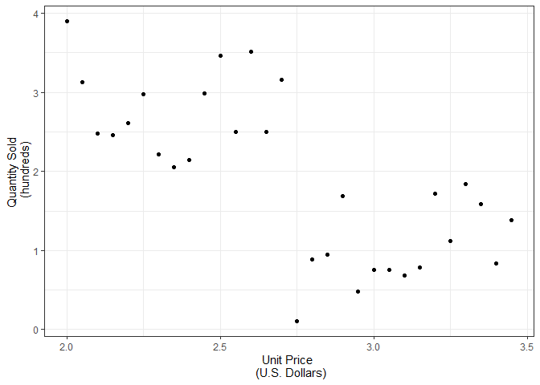
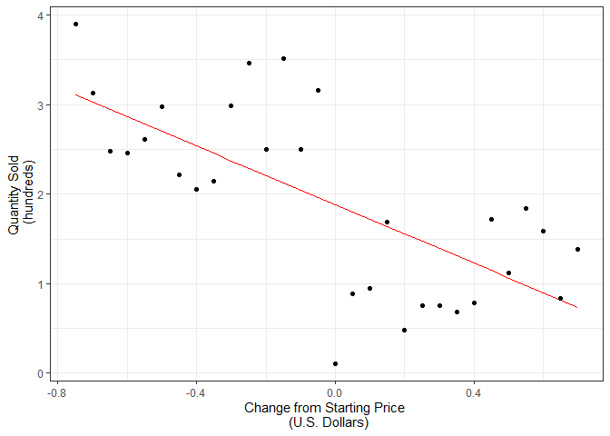

Simple Regression
================

## Study

Tom wants to examine how adjusting the pricing of product A affects the
quantity sold. The initial price of a single unit is $2.75.

``` r
set.seed(150)

##### Simulate data ---------------
lower.sales <- runif(n = 15, min = 0, max = 2)
upper.sales <- runif(n = 15, min = 2, max = 4)

df <- data.frame(
  Quantity = append(upper.sales, lower.sales),
  Price = seq(2, 3.45, .05)
)
```

## Visualization

First, we want to look at the data graphically.

``` r
library(ggplot2)
theme_set(theme_bw())

p <- ggplot() +
  geom_point(aes(x = Price, y = Quantity), df) +
  labs(
    x = "Unit Price \n (U.S. Dollars)",
    y = "Quantity Sold \n (hundreds)"
  ) 
p
```

<!-- -->

Once we model the data, our intercept will represent the quantity sold
when the price is 0. Tom is not necessarily interested in how his
hypothesis or model applies to the general population. Therefore, we
want to center the Price variable so the intercept represents the change
from our initial price.

``` r
df$Price.c <- df$Price - 2.75 
```

## Model

There appears to be a negative relationship between quantity sold and
unit price. Let’s see how a simple linear model would look. Note how our
centering changes the meaning of alterations in price, but does not
affect the spread of our values.

``` r
### Make model and predictions -----
mod1 <- lm(Quantity ~ Price.c, data = df)
mod1.summ <- summary(mod1)
df$preds <- predict(mod1, df)

### Plot regression line -----
ggplot() +
  geom_line(aes(x = Price.c, y = preds), color = 'red', df) +
  geom_point(aes(x = Price.c, y = Quantity), df) +
    labs(
    x = "Change from Starting Price \n (U.S. Dollars)",
    y = "Quantity Sold \n (hundreds)"
  ) 
```

<!-- -->

Using the centered predictor variable, our model will now represent how
change in price from product A’s initial sale price affects quantity
sold. Let’s model it and go through the most important parts of the
results.

``` r
options(scipen=1, digits=3) # number formatting

### Model
summary(mod1) 
```

    ## 
    ## Call:
    ## lm(formula = Quantity ~ Price.c, data = df)
    ## 
    ## Residuals:
    ##     Min      1Q  Median      3Q     Max 
    ## -1.7801 -0.4812  0.0378  0.6056  1.3883 
    ## 
    ## Coefficients:
    ##             Estimate Std. Error t value Pr(>|t|)    
    ## (Intercept)    1.883      0.139   13.51  8.6e-14 ***
    ## Price.c       -1.635      0.321   -5.09  2.2e-05 ***
    ## ---
    ## Signif. codes:  0 '***' 0.001 '**' 0.01 '*' 0.05 '.' 0.1 ' ' 1
    ## 
    ## Residual standard error: 0.762 on 28 degrees of freedom
    ## Multiple R-squared:  0.48,   Adjusted R-squared:  0.462 
    ## F-statistic: 25.9 on 1 and 28 DF,  p-value: 0.0000218

``` r
### Confidence interval
cints <- confint(mod1, c('(Intercept)', 'Price.c'), level=0.95)
cints
```

    ##             2.5 % 97.5 %
    ## (Intercept)  1.60  2.168
    ## Price.c     -2.29 -0.977

## Interpretation

#### Intercept

  - When the price is $2.75, the predicted quantity sold is 1.883
    (hundred) units

  - If we were to repeatedly replicate this experiment under identical
    conditions, there is a 95% chance that a price of $2.75 would result
    in sale quantities of between 1.597 and 2.168 (hundred) units

#### Price

  - Price is a statistically significant predictor of quantity sold
    (<i>p</i> \< .001)

  - For every dollar that the price increases, the quantity sold is
    expected to drop by 1.635 (hundred) units

  - If we repeatedly replicated this experiment, there is a 95% chance
    that the change in quantity sold for increasing pricing by an
    additional dollar would be between -2.294 and -0.977

#### Model

  - Our full model explains about 48% of the variance in the quantity
    sold
