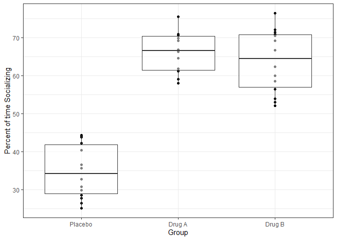
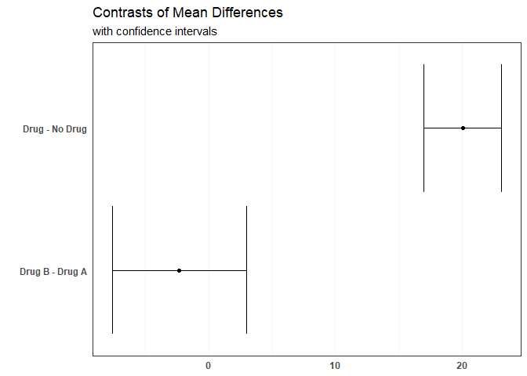

One-way ANOVA
================

## Study

Tim is a pharmacology researcher designing a study to test the
effectiveness of drugs A and B on treating social anxiety in rat
subjects with the disorder. He randomly assigns subjects to 3 groups:
Placebo (control), Drug A, and Drug B. That is; 14 subjects receive a
sugar pill, 14 receive Drug A, and 14 receive Drug B.

Each subject is given a 2-minute socialization period with a juvenile
subject. The percentage of time each subject spends exhibiting “social
behaviors” with the juvenile is recorded.

Specifically, Tim wants to know if:

1.  Giving subjects a drug treatment reduces social anxiety, especially
    the extent to which it does or does not. If the drug is to be
    considered “effective”, time socializing in the drug groups will be
    higher than the placebo group.
2.  One drug treatment is more effective than the other

## Data simulation

We simulate data from the random uniform distribution.

``` r
set.seed(1500)
options(scipen=1, digits=3) # number formatting

##### Simulate data ---------------
Placebo <- runif(n = 14, min = 20, max = 45)
drugA <- runif(n = 14, min = 57, max = 76)
drugB <- runif(n = 14, min = 52, max = 78)

df <- data.frame(
  Perc.social = append(append(Placebo, drugA), drugB),
  Group = append(append(rep('Placebo', 14), 
                 rep('Drug A', 14)),
                 rep('Drug B', 14)))

##### Format ---------------
df$Group <- factor(df$Group, levels = c('Placebo', 'Drug A', 'Drug B')) # reorder
```

First, let’s look at the data. We can look at both the distribution of
data points and quartile information by using a boxplot.

``` r
suppressMessages(library(ggplot2))
suppressMessages(library(dplyr))
theme_set(theme_bw())

##### Plot ---------------
p <- ggplot() +
  geom_point(aes(x = Group, y = Perc.social), df) +
  geom_boxplot(aes(x = Group,
                   y = Perc.social), alpha = 0.5, df) +
  labs(x = "Group", y = "Percent of time Socializing")

p
```

<!-- -->

## Model

Before we construct the model, we design contrasts to represent group
differences. These contrasts test Tim’s hypotheses 1 and 2,
respectively. Is there an effect of drug, and does this effect differ
between drugs?

``` r
##### Contrasts ---------------
con.1 <- c(-1, 0.5, 0.5) # Placebo vs. drug
con.2 <- c(0, -0.5, 0.5) # Drug A vs. Drug B

con.mat <- rbind(con.1, con.2)

rownames(con.mat) <- c('drug', 'A vs B')
colnames(con.mat) <- c('Placebo', 'Drug A', 'Drug B')

con.mat
```

    ##        Placebo Drug A Drug B
    ## drug        -1    0.5    0.5
    ## A vs B       0   -0.5    0.5

We give each contrast their own column in the main dataframe by
multiplying values of each contrast by their respective outcomes.

``` r
source('mcSummary.R')
suppressMessages(library(car))
suppressMessages(library(psych))
suppressMessages(library(lmSupport))

##### Apply contrasts ---------------
df$drug.con <- (df$Group == 'Placebo')*(-1) + (df$Group == 'Drug A')*(0.5) + (df$Group == 'Drug B')*(0.5)

df$AB.con <- (df$Group == 'Placebo')*(0) + (df$Group == 'Drug A')*(-0.5) + (df$Group == 'Drug B')*(0.5)

##### Model data ---------------
mod1 <- lm(Perc.social ~ drug.con + AB.con, data = df)
mod1.summ <- mcSummary(mod1)

mod1.summ
```

    ## $call
    ## lm(formula = Perc.social ~ drug.con + AB.con, data = df)
    ## 
    ## $anova
    ##               SS df     MS EtaSq    F  p
    ## Model       8488  2 4243.8 0.819 88.3  0
    ## Error       1875 39   48.1    NA   NA NA
    ## Corr Total 10362 41  252.7    NA   NA NA
    ## 
    ## $extras
    ##       RMSE AdjEtaSq
    ## Model 6.93     0.81
    ## 
    ## $coefficients
    ##               Est StErr      t   SSR(3) EtaSq tol CI_2.5 CI_97.5     p
    ## (Intercept) 54.93  1.07 51.346 126725.7 0.985  NA  52.77   57.09 0.000
    ## drug.con    20.06  1.51 13.259   8450.2 0.818   1  17.00   23.12 0.000
    ## AB.con      -2.31  2.62 -0.882     37.4 0.020   1  -7.61    2.99 0.383

## Interpretation

#### Intercept

  - On average, subjects spent 54.93 percent of the 2-minute test period
    exhibiting social behavior
  - If we replicated this study, there is a 95% chance that the mean
    percent of social time of all subjects would be between 52.766 and
    57.094

#### Contrast 1

  - Subjects that received a drug treatment spent an average of 20.06
    percent more time socializing than those who did not receive a drug
      - This difference is statistically significant
  - If we were to replicate this study, there is a 95% chance that the
    difference in means between the Placebo group and drug groups would
    between 17 and 23.12
  - Drug intake explains 94.3% of variance in time spent socializing

#### Contrast 2

  - Of subjects that received a drug, ones that received Drug B spent an
    average of -2.311 percent more time socializing than those who
    received a drug
      - This difference is not statistically significant
  - There is a 95% chance that if we replicated our experiment, the
    difference in means between subjects that received Drug A and
    subjects that received Drug B is between -7.611 and 2.99
  - The difference in drugs explains 12.6% of the variance in time spent
    socializing

## Visualization

To visualize our summary, we can convert the coefficients from our
summary object into a data frame. We also add label variables for our
plot.

``` r
### Extract coefficients
co <- as.data.frame(mod1.summ$coefficients) # extract coefficients

##### Create labels --------------
co$Comparison <- rownames(co)
comp.labs <- c('(Intercept)', 'Drug - No Drug', 'Drug B - Drug A')
co$Comp.labs <- factor(comp.labs, levels = comp.labs)

co <- co %>% filter(Comparison == 'drug.con' | Comparison == 'AB.con')
```

``` r
##### Plot --------------
results.plot <- ggplot(co) +
  geom_point(aes(x = Comp.labs, y = Est)) +
  geom_errorbar(aes(x = Comp.labs,
                    ymin = CI_2.5,
                    ymax = CI_97.5)) +
  scale_x_discrete(labels = co$Comp.labs,
                   breaks = co$Comp.labs,
                   limits = rev(co$Comp.labs)) +
  coord_flip()

##### Add labels and theme --------------
results.plot <- results.plot + 
  labs(x = '', y = 'Mean Difference',
    title = 'Contrasts of Mean Differences',
    subtitle = 'with confidence intervals') +
  theme(
    axis.title.x = element_blank(),
    axis.ticks = element_blank(),
    panel.grid.minor.x = element_line(color = 'gray96'),
    panel.grid.major.x = element_line(color = 'gray96'),
    panel.grid.minor.y = element_blank(),
    panel.grid.major.y = element_blank(),
    axis.text.x = element_text(face = 'bold'),
    axis.text.y = element_text(face = 'bold')
  )

results.plot
```

<!-- -->
