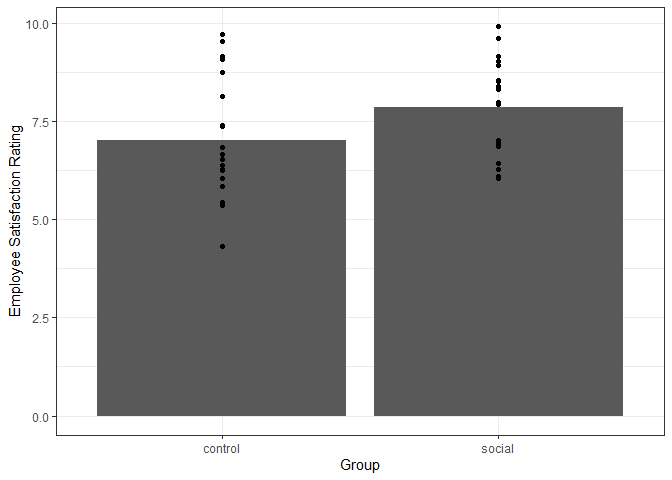

t-test
================

## Study

Sarah, an HR rep, is looking to improve employee satisfaction in Clinic
A. She hypothesizes that these employee satisfaction ratings can be
raised by adding a 15-minute socialization period in the afternoon. To
perform this, Sarah randomly selects half of the staff to receive the
socialization period (social group) and half to carry on business as
usual (control group).

``` r
set.seed(150)
options(scipen=1, digits=3) # number formatting

##### Simulate data ---------------
cont.grp <- runif(n = 20, min = 4, max = 10)
social.grp <- runif(n = 20, min = 6, max = 10)

df <- data.frame(
  Rating = append(cont.grp, social.grp),
  Group = append(rep('control', 20), rep('social', 20))
)
```

First, let’s look at the data. We can look at both the summary
statistics and the values by adding individual points to a bar graph of
the means.

``` r
suppressMessages(library(ggplot2))
suppressMessages(library(dplyr))
theme_set(theme_bw())

summ.df <- df %>% 
  group_by(Group) %>% 
  summarize(Rating = mean(Rating))

# percent change
perc.diff <- (summ.df$Rating[summ.df$Group == 'social'] - summ.df$Rating[summ.df$Group == 'control']) / abs(summ.df$Rating[summ.df$Group == 'control'])
perc.diff <- perc.diff*100

p <- ggplot() +
  geom_bar(aes(x = Group, y = Rating), summ.df, stat = 'identity') +
  geom_point(aes(x = Group, y = Rating), df) +
  labs(
    x = "Group",
    y = "Employee Satisfaction Rating"
  ) +
  theme(plot.title = element_text(hjust = 0.5))
p
```

<!-- -->

The social group seems to rate satisfaction higher than the control
group. However, the difference is so small that it looks like there’s a
good chance it could also be the result of coincidence. This is where
statistical modeling helps by giving us an idea of whether a
socialization period was a significantly effective manipulation in
increasing average employee satisfaction ratings and how big of an
effect it had and may have if our experiment is replicated.

## Model

To model this, we can simply use dummy coding in a regression context.

``` r
### Code variables
df$Group.code <- ifelse(df$Group == 'control', 0, 1)
```

By dummy coding our groups, we can interpret our results in terms of how
the presence of a socialization period is related to employee
satisfaction ratings.

``` r
### Make model and predictions -----
mod1 <- lm(Rating ~ Group.code, data = df)
mod1.summ <- summary(mod1)

mod1.summ
```

    ## 
    ## Call:
    ## lm(formula = Rating ~ Group.code, data = df)
    ## 
    ## Residuals:
    ##     Min      1Q  Median      3Q     Max 
    ## -2.7195 -0.9743 -0.0426  1.0924  2.6874 
    ## 
    ## Coefficients:
    ##             Estimate Std. Error t value Pr(>|t|)    
    ## (Intercept)    7.027      0.311   22.62   <2e-16 ***
    ## Group.code     0.823      0.439    1.87    0.069 .  
    ## ---
    ## Signif. codes:  0 '***' 0.001 '**' 0.01 '*' 0.05 '.' 0.1 ' ' 1
    ## 
    ## Residual standard error: 1.39 on 38 degrees of freedom
    ## Multiple R-squared:  0.0846, Adjusted R-squared:  0.0605 
    ## F-statistic: 3.51 on 1 and 38 DF,  p-value: 0.0686

``` r
df$preds <- predict(mod1, df)
```

We almost achieve statistical significance with p \> .05. In context,
however, an R-squared value of 0.085 is somewhat interesting, but the
actual decision to add the break period depends on the opportunity cost
for taking away 15 minutes from working.

``` r
### Model
summary(mod1) 
```

    ## 
    ## Call:
    ## lm(formula = Rating ~ Group.code, data = df)
    ## 
    ## Residuals:
    ##     Min      1Q  Median      3Q     Max 
    ## -2.7195 -0.9743 -0.0426  1.0924  2.6874 
    ## 
    ## Coefficients:
    ##             Estimate Std. Error t value Pr(>|t|)    
    ## (Intercept)    7.027      0.311   22.62   <2e-16 ***
    ## Group.code     0.823      0.439    1.87    0.069 .  
    ## ---
    ## Signif. codes:  0 '***' 0.001 '**' 0.01 '*' 0.05 '.' 0.1 ' ' 1
    ## 
    ## Residual standard error: 1.39 on 38 degrees of freedom
    ## Multiple R-squared:  0.0846, Adjusted R-squared:  0.0605 
    ## F-statistic: 3.51 on 1 and 38 DF,  p-value: 0.0686

``` r
### Confidence interval
cints <- confint(mod1, 'Group.code', level=0.95)
cints
```

    ##              2.5 % 97.5 %
    ## Group.code -0.0661   1.71

Our model would be represented as:

<i> Rating = 7.027 + (0.823)Group + Error </i>

## Interpretation

  - A socialization period (Group) resulted in an almost-statistically
    significant difference in employee satisfaction ratings (p = 0.069)
  - In the absence of a socialization period, ratings are, on average,
    7.027
  - When a socialization period is present, employee satisfaction
    ratings are expected to be 0.823 points higher than those who do not
    receive one; a difference of about 11.717
  - If we were to accurately replicate this experiment, there is a 95%
    chance that the change in ratings from the addition of a
    socialization period is between -0.066 and 1.713
  - Our model explains about 0.085 of the variance in quantity sold
